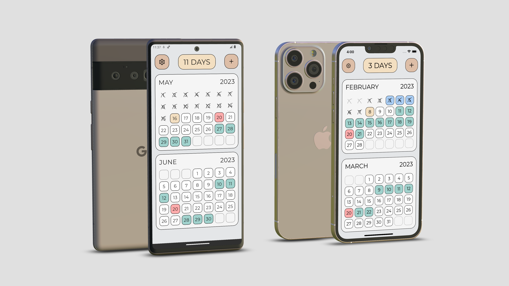

# LCalendar (feat. KMM)

Welcome to LCalendar! This app is designed to help couples in long-distance relationships keep track of the days remaining until their next meeting.

## Features

- **Plan meetings with your special ones:** You and your partner can choose the days of your next meeting and see how many days are left in the app.
- **Keep track of your special dates:** You can add special dates like anniversaries to be highlighted in the app.

## Installation

To install LCalendar for Android, follow these steps:
1. Go to the "Releases" section of this repository.
2. Download the latest APK file.
3. Install the APK on your Android device.
4. Launch LCalendar and enjoy!

Unfortunately, the iOS version is currently unavailable for direct download. However, you can download the project and run it from Xcode to see the demo.

## Contributing

If you have any questions, suggestions, or issues regarding this project, don't hesitate to contact me at paulmais.dev@gmail.com. Contributions and feedback are highly appreciated.

## Credits

- **Device Mockup:** Image created from [Google Pixel 6 mockups](https://deviceframes.com/templates/google-pixel-6).

## License

LCalendar is licensed under the [LICENSE](LICENSE.txt) file. Please review the license for detailed information on permissions and restrictions.
